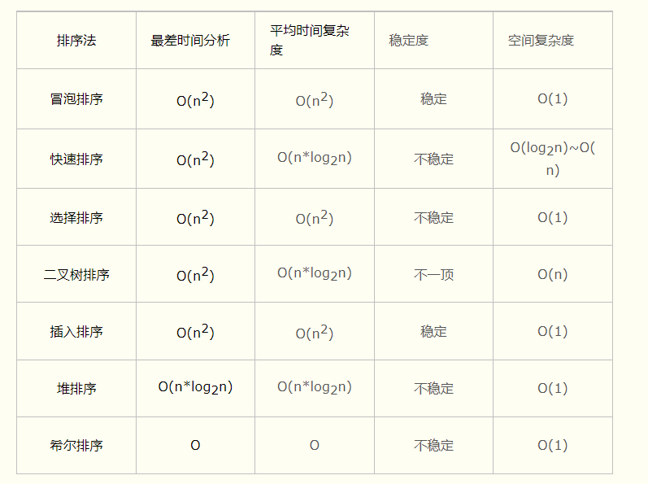

# 数据结构
#### 1.常见的排序算法以及时间复杂度？
  
[常见排序算法](https://www.cnblogs.com/angelye/p/7508292.html)  
+ 冒泡排序，O(n2)，通过重复走完数组的所有元素，通过两两比较，直到没有数可以交换
的时候结束这个数，再到下个数，直到整个数组排好顺序。
+ 插入排序，O(n2)，每次从未排好序的数据堆中拿出一个数，插入到已排好序的数据队列
的正确位置。
+ 选择排序，O(n2)，每次从未排好序的数据堆中找到最小的数，插入到已排好序的数据队
列的头部。
+ 快速排序，O(N*logN)，以数据堆中的一个数为标准，将数据堆分为小于等于和大于该数
的两堆，对于分割后的两堆数再分别利用上述方法进行分割，以此类推，直到堆中只有一
个数为止。
+ 堆排序，O(N*logN)，将数据堆中的数两两组队排序，对于排序好的这些子堆再两两组队
排序，以此类推，直到只剩下一个堆。
+ 归并排序，O(N*logN)，基于堆的排序算法，分为最大堆和最小堆。排序分为两个过程堆
的构造和堆的排序。
#### 2.常见算法题
+ 手写LRU
+ 接雨水
+ 因数分解
+ 快速排序
+ 最长上升子序列
+ 数组原地去重
+ 字符串去掉空格忽略大小写判断是否相同
+ 最长公共子串
+ 链表倒数第n个节点
+ 全排列
+ 二叉树中路径和为目标值的所有路径
+ 可重入锁的阻塞队列
+ 返回子数组的最大累加和
+ 两个栈实现队列
+ 合并有序链表
+ 二维数组，对角线输出元素
+ 链表相加