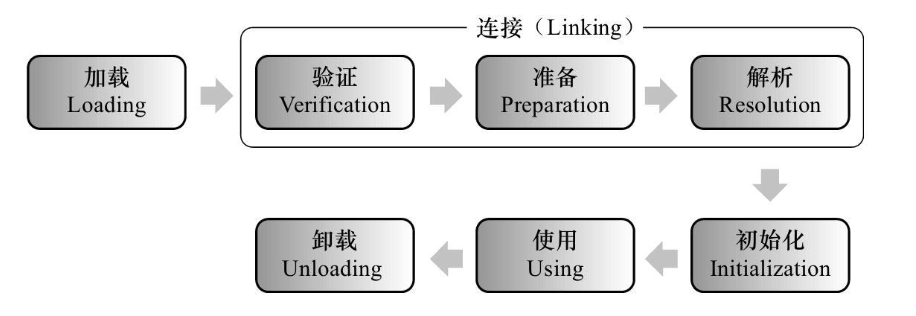

#### 1.说下类加载器与类加载？加载的类信息放在哪个区域？
一个类型从被加载到虚拟机内存开始，到卸载出内存为止，它的整个生命周期将会经历加载
（Loading）、验证（Verification）、准备（Preparation）、解析（Resolution）、初始化
（Initialization）、使用（Using）和卸载（Unloading）七个阶段。其中验证、准备、解析
三个部分统称为连接（Linking）。
Java 虚拟机设计团队把类加载阶段中“通过一个类的全限定名来获取描述该类的二进制流”
这个动作放到 Java 虚拟机外部去实现。比便让程序应用自己决定如何取获取所需的类。实现
这个动作的代码被称为“类加载器”（Class Loader）。
对于任意一个类，都必须由加载它的类加载器和这个类本身一起共同确立其在 Java 虚拟机中
的唯一性，每一个类加载器，都拥有一个独立的类名称空间。
#### 2.jvm类加载机制
JVM 类加载机制分为五个部分：加载，验证，准备，解析，初始化，下面我们就分别来看一下这
五个过程。
  
+ 加载是类加载过程中的一个阶段，这个阶段会在内存中生成一个代表这个类的 java.lang.Class 对
象，作为方法区这个类的各种数据的入口。注意这里不一定非得要从一个 Class 文件获取，这里既
可以从 ZIP 包中读取（比如从 jar 包和 war 包中读取），也可以在运行时计算生成（动态代理），
也可以由其它文件生成（比如将 JSP 文件转换成对应的 Class 类）。
+ **验证**：这一阶段的主要目的是为了确保 Class 文件的字节流中包含的信息是否符合当前虚拟机的要求，并
且不会危害虚拟机自身的安全
+ **准备**：准备阶段是正式为类变量分配内存并设置类变量的初始值阶段，即在方法区中分配这些变量所使
用的内存空间。注意这里所说的初始值概念，比如一个类变量定义为：`public static int v = 8080`
实际上变量 v 在准备阶段过后的初始值为 0 而不是 8080，将 v 赋值为 8080 的 put static 指令是
程序被编译后，存放于类构造器<client>方法之中。
但是注意如果声明为：`public static final int v = 8080;`在编译阶段会为 v 生成 ConstantValue 属性，在准备阶段虚拟机会根据 ConstantValue 属性将 v
赋值为 8080。
+ **解析**：解析阶段是指虚拟机将常量池中的符号引用替换为直接引用的过程。符号引用就是 class 文件中
  的：
  1. CONSTANT_Class_info
  2. CONSTANT_Field_info
  3. CONSTANT_Method_info
    等类型的常量。
+ **初始化**：初始化阶段是类加载最后一个阶段，前面的类加载阶段之后，除了在加载阶段可以自定义类加载
器以外，其它操作都由 JVM 主导。到了初始阶段，才开始真正执行类中定义的 Java 程序代码。
#### 3.什么是双亲委派机制，它有什么作用？
双亲委派机制的意思是除了顶层的启动类加载器以外，其余的类加载器，在加载之前，都会委派给它的父加载器进行加载。这样一层层向上传递，直到祖先们都无法胜任，它才会真正的加
载。
+ 通过带有优先级的层级关可以避免类的重复加载；
+ 保证 Java 程序安全稳定运行，Java 核心 API 定义类型不会被随意替换。
#### 4.如何破坏双亲委派机制？
首先破坏双亲委派模型，第一步就是要实现自定义类加载器，集成 class 类，实现自定义类加载要实
现两个方法 findclass 方法和 loadclass 方法，首先呢 loadclass 方法如果没有重写，那就是默认的双亲
委派模型，如果重写了就可以打破。而 findclass 方法，是为了保证在父类加载器完成不了类加载请
求的时候，这个方法需要完成类加载的逻辑。所以打破双亲委派就重写 loadclass 方法。
Tomcat 通过自定义类加载器 WebappClassLoader 只加载自己目录下的 class 文件，即重写 loadClass()
方法，不传递给父类加载器。  
为什么要破坏？  
热部署，比如：修改 jsp 文件以后不用重新启动系统。可以让一个类有一个自己的类加载器，不依靠
父类加载器，就意味着当你想重写加载这个 class 对象的时候，就先把自定义的类加载器卸载，然后
重新加载一变这个 class 对象就好了，不用重新启动系统。
为了在部署多个独立项目时，项目能加载到相同类库的不同版本。默认的类加载机制无法加载同一
类库的不同版本。
#### 5.CMS垃圾收集器说一下？
#### 6.JVM内存模型说一下？
#### 7.请问JDK与JVM有什么区别？
现在的JDK、JRE和JVM一般是整套出现的。  
JDK = JRE + 开发调试诊断工具  
JRE = JVM + Java标准库   
#### 8.volatile和synchronized的区别？ 
+ volatile 关键字是线程同步的轻量级实现，所以volatile 性能肯定比 synchronized 关键字
要好。但是volatile 关键字只能用于变量而 synchronized 关键字可以修饰方法以及代码块。  
+ volatile 关键字能保证数据的可⻅性，但不能保证数据的原子性。synchronized 关键字两
者都能保证。
+ volatile 关键字主要用于解决变量在多个线程之间的可⻅性，而 synchronized 关键字解决
的是多个线程之间访问资源的同步性。

